# Ausgleichung

## 1. Projektionsdistanzen

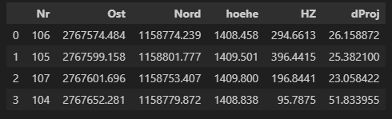

## 4. Näherungswerte der Unbekannten & der Beobachtungen

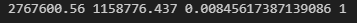\
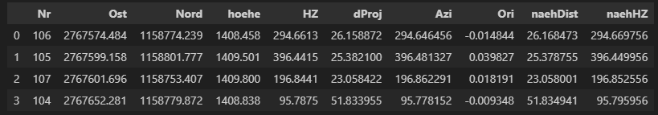

## 5. A-Matrix

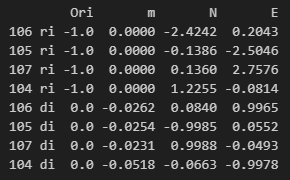

## 5. F-Vektor

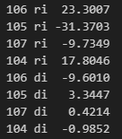

## 6. Standardabweichungen der Beobachtungen

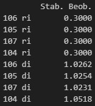

## 7. Gewichte der Beobachtungen (P-Matrix)

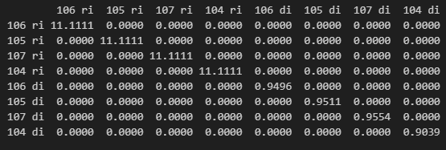

## 9. Berechnung der Unbekannten

### N-Matrix

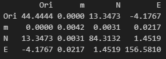

### Qxx-Matrix

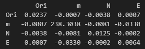

### n-Vektor

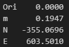

### x-Vektor

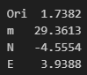

## 10. Ausgeglichene, volle Unbekannte

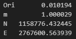

## 11. Verbesserungen der Beobachtungen

### Aus Matrixmultiplikation

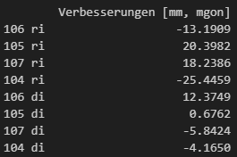

### Aus Beobachtungsgleichung

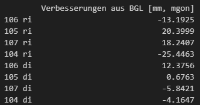

## 12. ausgeglichene Beobachtungen

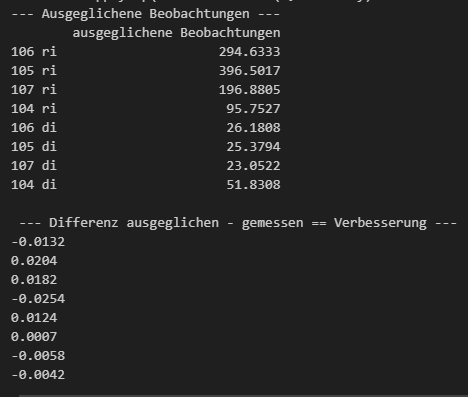

# Genauigkeiten

## 1. Freiheitsgrad

n = 8, u = 4, f = 4

## 2. Modelltest

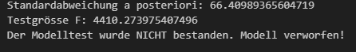

## 3. Genauigkeit der Koordinaten

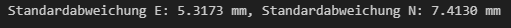

## 4. Schlussprobe

## 5. Ausgabe der Unbekannten & Genauigkeit

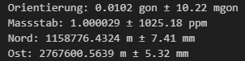
